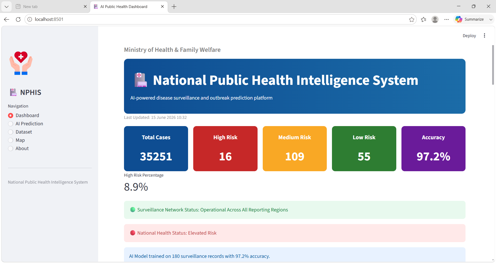
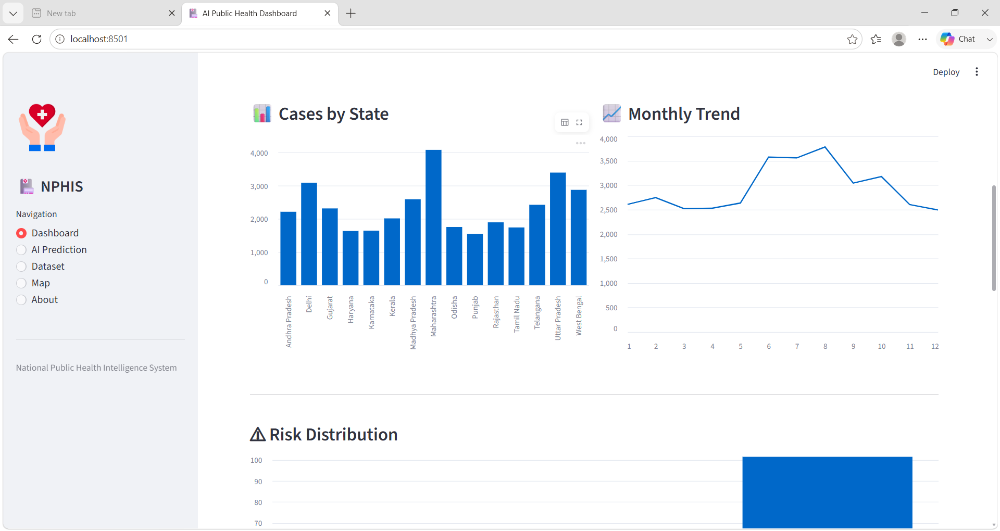
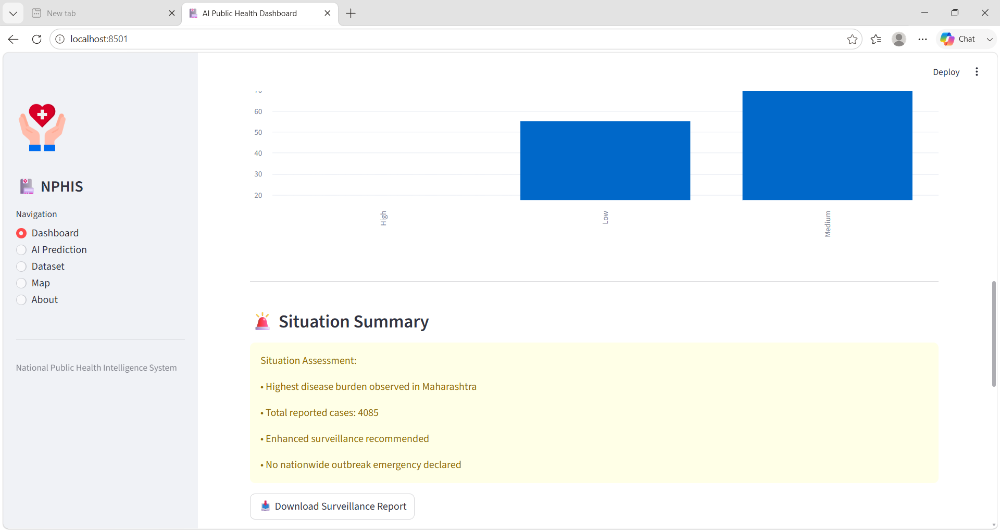
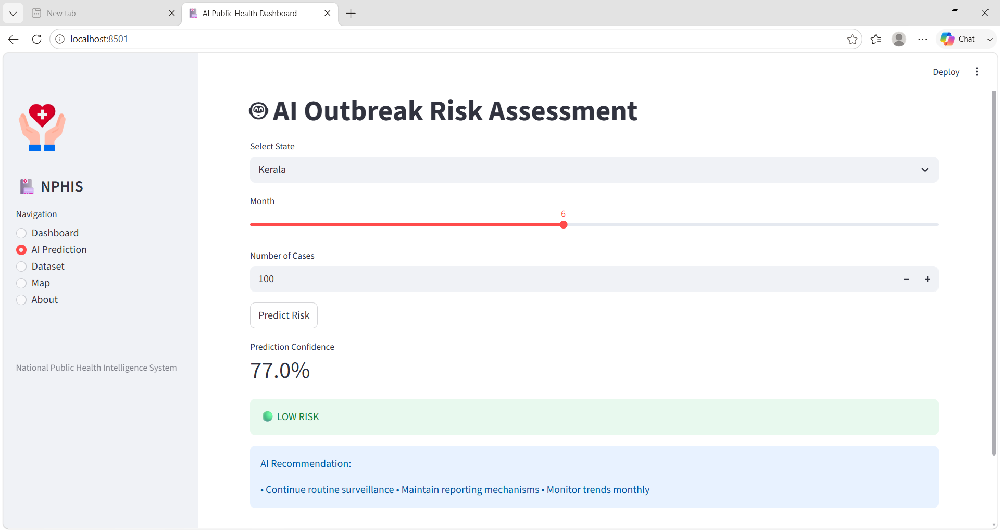
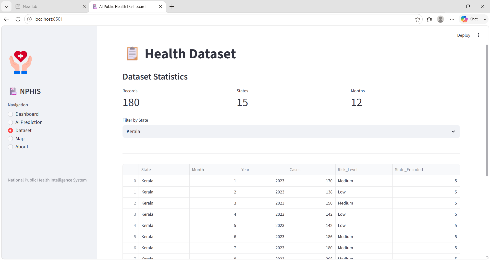
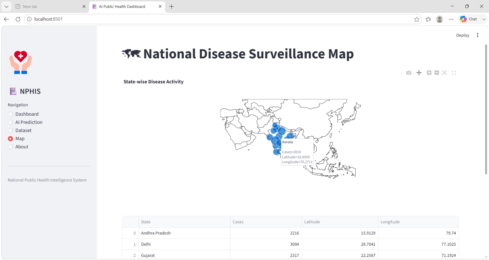

# 🏥 National Public Health Intelligence System (NPHIS)

AI-powered disease surveillance and outbreak prediction platform built using Streamlit and Machine Learning.

## 📌 Overview

The National Public Health Intelligence System (NPHIS) is an AI-powered platform designed to support disease surveillance, outbreak monitoring, and risk assessment. The system provides real-time analytics, interactive visualizations, and machine learning-based outbreak risk prediction.

---

## 🚀 Features

- 📊 Interactive Public Health Dashboard
- 🤖 AI-Based Risk Prediction
- 🗺️ State-wise Disease Surveillance Map
- 📈 Monthly Trend Analysis
- 📋 Dataset Filtering and Exploration
- ⚠️ Risk Distribution Monitoring
- 📥 Downloadable Health Reports

---

## 🛠️ Technology Stack

- Python
- Streamlit
- Pandas
- Scikit-Learn
- Random Forest Classifier
- Plotly

---

## 📸 Screenshots

### Dashboard


### Dashboard Analytics


### Dashboard Insights


### AI Prediction


### Dataset


### Disease Surveillance Map


---

## 🤖 Machine Learning Model

Algorithm Used:

- Random Forest Classifier

Input Features:

- State
- Month
- Cases

Output Classes:

- Low Risk
- Medium Risk
- High Risk

---

## 🎯 Objective

To assist public health authorities in monitoring disease trends, identifying potential outbreaks, and supporting data-driven decision making through AI-powered analytics.

---

## ▶️ Run Locally

```bash
pip install -r requirements.txt
streamlit run app.py
```

---

## 👩‍💻 Developer

Kavya S Nair

Final Year Student | Full Stack & AI Enthusiast